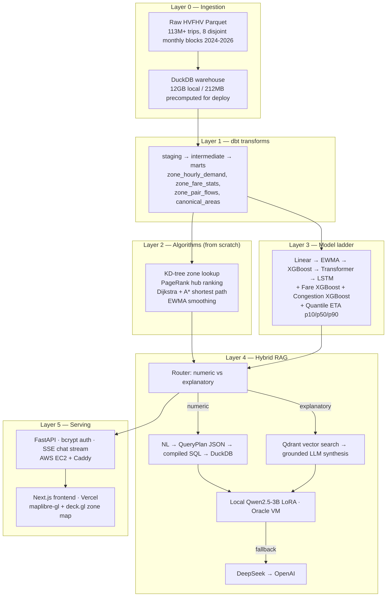

# NYC Ride Intelligence — TLC Mobility Platform

This project takes **113M+ real NYC Uber/Lyft trip records** and turns them into a working mobility-intelligence product: you can ask it "what will demand at JFK look like at 6pm tomorrow?" or "why is this zone so busy?" and get an answer backed by a real trained model or a real SQL query — never a guess dressed up as one. It's built the way a real data platform is built: clean the data, transform it, run classical algorithms and trained models on it, then put an AI layer *on top of* that foundation instead of asking the AI to invent the numbers itself.

Every metric in this README is copied from this repo's own eval output — the project's own house rule is "no fabricated metrics," and that applies to documentation too, including a couple of numbers below that are honestly reported as *not great* (a slightly under-covered prediction interval, a stale LSTM run) rather than rounded up to look better.

🔗 **Live app:** [teerth-atlas-nyc.online](https://teerth-atlas-nyc.online) — backend on AWS EC2, frontend on Vercel.


---

## Table of contents

- [The big picture](#the-big-picture)
- [Tech stack](#tech-stack)
- [1. Where the data comes from](#1-where-the-data-comes-from)
- [2. Turning raw trips into answerable tables (dbt)](#2-turning-raw-trips-into-answerable-tables-dbt)
- [3. Algorithms built from scratch, proven correct](#3-algorithms-built-from-scratch-proven-correct)
- [4. Teaching models to predict — the model ladder](#4-teaching-models-to-predict--the-model-ladder)
- [5. Answering questions in plain English — hybrid RAG](#5-answering-questions-in-plain-english--hybrid-rag)
- [6. Training and hosting its own small AI model](#6-training-and-hosting-its-own-small-ai-model)
- [7. Proving the AI actually gets it right](#7-proving-the-ai-actually-gets-it-right)
- [8. Letting AI assistants use the platform directly (MCP)](#8-letting-ai-assistants-use-the-platform-directly-mcp)
- [9. The API and how sign-in works](#9-the-api-and-how-sign-in-works)
- [10. Real-time chat: the WebSocket → SSE story, in detail](#10-real-time-chat-the-websocket--sse-story-in-detail)
- [11. Frontend](#11-frontend)
- [12. Watching the system while it runs](#12-watching-the-system-while-it-runs)
- [13. Where it actually runs, and why](#13-where-it-actually-runs-and-why)
- [14. Real problems that came up, and how they were found and fixed](#14-real-problems-that-came-up-and-how-they-were-found-and-fixed)
- [15. Testing](#15-testing)
- [16. Scalability — from one city to a global platform](#16-scalability--from-one-city-to-a-global-platform)
- [Quick start](#quick-start)
- [Repository layout](#repository-layout)

---

## The big picture

The platform is built as six layers, each one strictly depending on the layer below it and never reaching past it — the API never recomputes an aggregate the transformation layer already built, and the AI layer never touches a raw trip row directly. That discipline is what keeps a system this size honest: if a number is wrong, there's exactly one place it could have gone wrong, not three.



Reading it top to bottom: raw trip files land in a database (Layer 0), get cleaned and pre-aggregated into tables that are actually fast to query (Layer 1), classical algorithms and trained models run on top of those tables to produce predictions (Layers 2-3), a hybrid AI layer decides whether a user's question needs a real number pulled from the database or an explanation synthesized from retrieved context (Layer 4), and finally an API and web app expose all of it to a real user (Layer 5).

One more thing worth calling out: startup is deliberately fault-isolated. `backend/main.py` loads seven separate things when the server boots — model artifacts, registries, tariff profiles — and each one is wrapped in its own try/except. If one artifact is missing, that one feature reports itself as `"unavailable"` instead of taking the whole API down. A missing LSTM checkpoint shouldn't mean fare prediction stops working.

## Tech stack

| Layer | Technology |
|---|---|
| **Warehouse** | DuckDB — columnar, vectorized, a single file, no server to run (see [ADR-001](docs/adr/ADR-001-duckdb-over-postgres.md)) |
| **Transformation** | dbt (staging → intermediate → marts), `dbt_utils` |
| **Algorithms** | Pure Python/NumPy — KD-tree, PageRank, Dijkstra, A*, EWMA — each checked against a real library (`scikit-learn`/`networkx`) so a bug shows up as a failing test, not a wrong answer in production |
| **ML** | XGBoost 3.x, scikit-learn, PyTorch (LSTM + Transformer), native quantile regression (`reg:quantileerror`) |
| **LLM / fine-tuning** | Qwen2.5-3B-Instruct, LoRA (PEFT + `unsloth`, trained on a free Colab T4), `llama.cpp` GGUF serving, DeepSeek + OpenAI as hosted fallback |
| **Vector search** | Qdrant Cloud (free tier), `text-embedding-3-small` |
| **RAG orchestration** | A custom router + QueryPlan compiler (the LLM never writes SQL text itself), traced with Langfuse |
| **Backend** | FastAPI, Pydantic v2, `uvicorn`, bcrypt, SQLAlchemy 2.0 + psycopg (Neon Postgres), loguru |
| **Frontend** | Next.js 14 (App Router), TypeScript, Tailwind, maplibre-gl / react-map-gl / deck.gl, GSAP, Framer Motion, TanStack Query, Zod |
| **Infra** | Docker, Caddy (auto-TLS reverse proxy), AWS EC2 (Graviton, via CDK/Python), an Oracle Always-Free VM, Vercel, GitHub Actions (OIDC, no long-lived AWS keys) |
| **Data stores** | DuckDB (analytics), Neon Postgres (auth/sessions/chat history), Qdrant (vectors) |

---

## 1. Where the data comes from

The dataset is NYC TLC's **High-Volume For-Hire Vehicle (HVFHV)** trip log — this is the Uber/Lyft/Via/Juno data, not the older yellow/green taxi data, and the two have genuinely different schemas (`hvfhs_license_num` carrier codes, `PULocationID`/`DOLocationID` instead of named boroughs, `base_passenger_fare` instead of a metered `fare_amount`). Right now the warehouse holds **113,063,227 real trip rows**.

Those rows don't form one continuous timeline, though — TLC only publishes certain months, so what actually exists on disk is **8 separate monthly blocks**: `2024-01, 2024-03, 2024-06, 2025-01, 2025-11, 2026-01, 2026-03, 2026-04`, with real gaps in between. That sounds like a minor detail, but it drives a real design decision downstream: any train/test split has to respect those block boundaries, or it silently mixes "future" data into "past" training rows just because of where the row-count cutoff happens to fall (see §4).

`scripts/load_raw_to_duckdb.py` is the ingestion step — it reads the raw Parquet files straight into a local DuckDB file (`data/warehouse/nyc_rides.duckdb`, about 12GB). That 12GB file is fine for local development, but it's far too big to ship inside a deploy image, so a second script (`scripts/build_deployed_duckdb.py`) exists purely to solve that problem: it precomputes only the ~13 tables the live API actually reads from and throws away the other 100M+ raw rows the API never touches directly. The result is a **212MB file instead of 12GB** — a 55x reduction — and how that script went from broken to load-bearing is one of the real bugs described in §14.

Postgres, separately, is used only for auth/session/chat-history data — that's **Neon** (serverless Postgres), not a self-managed database.

## 2. Turning raw trips into answerable tables (dbt)

Raw trip rows aren't something you'd want to query directly for every API request — a "what's the average fare from JFK" question shouldn't mean scanning 113M rows every time someone asks it. dbt is the layer that turns raw data into fast-to-query, purpose-built tables, in three stages:

- **Staging** (`stg_trips`, `stg_zones`) — just cleans and renames columns from the raw files into a consistent shape. Nothing clever happens here on purpose; it's the one place that knows about the raw schema so nothing downstream has to.
- **Intermediate** (`int_trips_enriched`) — joins every trip to its pickup and dropoff zone information. This is the single 113M-row table everything else in the project ultimately reads from — algorithms, models, and the RAG layer all trace back to this table, never to the raw files.
- **Marts** — the tables actually built to answer specific questions fast: `zone_hourly_demand` (how many pickups happened in each zone, each hour, joined with real weather), `zone_fare_stats` (fare statistics per zone pair), `zone_pair_flows` (an origin-destination flow graph, including average speed), and `canonical_areas` (the zone dimension table, deliberately shaped as `area_id/city_id/area_type` rather than NYC-specific fields — a seam left in place for a possible second city, see §16).

Every mart has real dbt tests attached (`not_null`, `unique`, `accepted_values`, `relationships`) that run as part of `dbt build`/`dbt test` — so a broken join or a null creeping into a primary key fails the build instead of silently corrupting a downstream prediction.

## 3. Algorithms built from scratch, proven correct

This section exists to show these classical algorithms are actually understood, not just imported. Each one below is hand-implemented — no library does the actual computation — and then checked against a trusted reference library on the same input, so a bug shows up as a failing test rather than a subtly wrong answer nobody notices.

**KD-tree — "which zone is this pickup actually closest to?"** A KD-tree is a data structure that organizes points in space so you can find the nearest one to a query point without checking every single candidate. Built here for zone lookup (263 zones), and its correctness is checked by comparing its answer to `scipy`'s nearest-neighbor search on the same coordinates. It's also genuinely faster: a real benchmark over 2,000 queries measured **28.8µs per query for the KD-tree versus 155.6µs for a plain linear scan — a 5.4x speedup**.

**PageRank — "which zones act like hubs?"** The same algorithm Google originally used to rank web pages by how many important pages link to them, applied here to the trip-flow graph instead of the web: a zone that receives a lot of trips from other well-connected zones ranks higher, the same way a page linked from other important pages ranks higher. Run over 262 zones and 63,755 weighted edges with the standard 0.85 damping factor, the top-ranked real zone (after an "Outside of NYC" catch-all) is **LaGuardia Airport**, then **JFK** — which matches intuition for a mobility hub ranking, and is a genuine output of the algorithm, not hand-picked.

**Dijkstra and A\* — "what's the fastest path between two zones?"** Dijkstra's algorithm finds the shortest path in a weighted graph by expanding outward from the start node, always exploring the cheapest known option next. A\* is the same idea but smarter — it also uses a heuristic (an estimate of remaining distance) to avoid wasting time exploring nodes that obviously aren't on the way. Both are implemented and checked against `networkx`'s implementation on the same zone graph; A\*'s output is additionally checked to match Dijkstra's cost exactly (a smarter search shouldn't mean a worse answer). Over 200 sampled zone pairs, A\* expanded an average of **89.4 nodes versus Dijkstra's 126.4 — 29.3% fewer** — and the heuristic itself isn't a guessed constant: the max implied speed it assumes (120 km/h) was measured directly off all 63,060 real graph edges rather than assumed, because an unrealistically low speed constant would have silently made the heuristic invalid and let A\* return non-optimal paths without ever raising an error (see §14).

**EWMA — smoothing out noisy demand.** An exponentially weighted moving average gives more weight to recent observations and less to older ones, which is a simple, cheap way to track a trend without a full model. Implemented here (α=0.5 as the repo-wide default) both as a standalone forecasting baseline and as a feature fed into the demand models below, and checked against `pandas`'s own `.ewm()` implementation.

## 4. Teaching models to predict — the model ladder

The idea behind a "model ladder" is simple: start with the dumbest thing that could possibly work, then only add complexity if it actually earns its keep on data the model never saw during training. Every model here is trained with a fixed `seed=42` and evaluated on a **chronological split** ([ADR-003](docs/adr/ADR-003-chronological-split.md)) — meaning the test set is always the most recent block of time, held out entirely, never a random sample mixed in with training data. A random split would let a model "see the future" (a Tuesday afternoon in March sitting right next to a Tuesday afternoon that's supposedly unseen test data), which quietly inflates accuracy in a way that doesn't show up until the model is wrong in production. Every split has its own leakage-guard assertion (`max(train.ts) < min(val.ts) < min(test.ts)`) checked both in the training code and in a dedicated test.

### Demand forecasting — "how many pickups will this zone see next hour?"

Five models were trained on the same features (hour of day, day of week, three lag windows, an EWMA term, a rolling 7-day average, and real hourly weather) and scored on the identical held-out 143,730-row block from April 2026, so the comparison is apples-to-apples:

| Model | RMSE | MAE | Inference latency |
|---|---|---|---|
| EWMA baseline | 50.310 | 29.068 | 0.0016 ms/row |
| Linear regression | 26.558 | 15.374 | 0.010 ms/row |
| **XGBoost (winner)** | **24.220** | **12.630** | 0.034 ms/row |
| Transformer (attention over 24h) | 26.343 | 14.986 | 0.415 ms/row |
| LSTM | ~~96.925~~ *(stale artifact, see below)* | — | 0.021 ms/row |

XGBoost wins, and the reason why is visible in its own feature importances: a single feature, "how many pickups happened in this exact zone one hour ago," accounts for the large majority of its predictive power, with "same hour, one week ago" a distant second — together those two account for 97% of the model's gain. The Transformer, which learns the shape of the last 24 hours on its own instead of relying on hand-picked lag features, actually loses to XGBoost on both error metrics while being about 23x slower per prediction — a genuine negative result, reported rather than hidden, because a fancier model isn't automatically a better one.

The LSTM row is crossed out on purpose: its saved weights were fit on the older, much smaller 2024-only version of the warehouse, and its output-scaling constants belong to that smaller scale — scoring it against the current, larger dataset de-normalizes its predictions with the wrong numbers, which is where the nonsensical 96.9 RMSE comes from. Retraining it on the current warehouse is open, tracked work; the honest current ladder is EWMA → linear → XGBoost.

### Fare prediction — "what will this ride cost?"

A single tuned XGBoost regressor predicts the total fare from pickup zone, dropoff zone, hour, day of week, and trip distance. It was originally trained on a narrow 3-month slice of 2024 data and scored 12.61 RMSE on a June-2024 holdout — then, on 2026-08-30, it was retrained on the **full 113M-row warehouse** using a GPU streaming/external-memory training path, because the original approach couldn't fit that much data in memory at once:

| Split | RMSE | MAE |
|---|---|---|
| validation (19.3M rows) | 13.21 | 7.01 |
| **test (21.0M rows, held out whole)** | **12.77** | **6.78** |

Test error actually rose slightly, from 12.61 to 12.77 — and that's reported as a real, honest result rather than smoothed over: the fuller, more recent 8-block dataset genuinely is a little harder to predict than the old narrow 3-month window it used to train on, because it now has to generalize across more seasons and more fare-structure changes. All four hyperparameter candidates tried during tuning landed in the same tight validation-RMSE band, so this isn't one unlucky configuration — it's the real effect of more (and more varied) data.

### Congestion multiplier — "how much slower is traffic making this trip?"

This model predicts a multiplier: actual trip duration divided by an estimated "free-flow" duration (how long the trip would take with no traffic). There's an important caveat here, stated plainly rather than glossed over: this repo has **no real road-graph or routing data**, so "free-flow speed" is approximated as the 85th-percentile observed speed within a given trip-distance bucket — the fastest ~15% of real trips at that distance stand in for free-flow conditions. Every prediction this model makes is tagged `free_flow_source: "estimated"` so nothing downstream mistakes it for a measurement.

| Split | RMSE | MAE |
|---|---|---|
| validation (19.2M rows) | 0.474 | 0.346 |
| **test (21.0M rows)** | **0.485** | **0.357** |

This model was already trained on the full dataset before the GPU migration, so the retrain mostly confirms reproducibility (0.4850 → 0.4849 RMSE) rather than fixing a data-scale gap the way the fare model's retrain did.

### Quantile ETA — not just "how long," but "how confident are we?"

Instead of predicting a single trip-duration number, three independent XGBoost models are trained to predict the 10th, 50th, and 90th percentile of trip duration, using XGBoost's native pinball-loss quantile objective. The point of this isn't to replace the point-estimate ETA — it's to measure how well-calibrated an 80% confidence interval actually is, which a single point prediction can't tell you.

| Quantile | MAE (minutes) |
|---|---|
| p10 | 6.39 |
| p50 | 4.36 |
| p90 | 9.01 |

On **20,952,719** held-out rows, the actual trip duration fell inside the `[p10, p90]` predicted interval **79.46% of the time**, against an 80% nominal target — reported as a genuine, small under-coverage rather than rounded up to "well calibrated." The three models occasionally disagree on ordering (p10 should never exceed p50, which should never exceed p90) since nothing forces them to agree — that happens on 1,435 of the 20.95M rows, about 0.0068%, small enough to call expected noise rather than a systemic problem.

Getting a clean number here took real debugging: an earlier full-scale GPU run looked completely broken, showing only 0.55% coverage against an 80% target. Rather than assume the whole approach was flawed, the fix was to build a proper streamed training path and then retest it at increasing data scale — 10M rows, 20M, 40M, all the way to the full 113M — to see whether the original failure was some kind of scale threshold. It wasn't: the rewritten pipeline came out clean at every single scale tested, which pointed the root cause at the original training script rather than the underlying method.

Worth noting: the ETA the platform actually serves to users isn't one of these three quantile models — it's composed explicitly as `ETA = free-flow time × congestion multiplier`, using the two models from the section above. The quantile models exist specifically to measure how trustworthy an interval estimate would be, kept separate from what's actually served, so the "real" prediction path stays simple and inspectable.

---

## 5. Answering questions in plain English — hybrid RAG

This is the layer a user actually talks to when they type a question into the chat interface. The core design problem it solves: large language models are fluent, but they'll happily state a wrong number with complete confidence, and for a data platform that's disqualifying. The fix here is architectural, not a prompting trick — a **router** looks at every incoming question and decides which of two fundamentally different paths it needs, before any answer-generation happens ([ADR-004](docs/adr/ADR-004-hybrid-rag-nl-to-sql.md)).

**If the question has a factual numeric answer** ("what's the average fare from JFK?"), the LLM is never allowed to write SQL text itself — that's a real, deliberate constraint, because an LLM that writes its own SQL can also write subtly wrong SQL with no way to catch it. Instead, the LLM's only job is to emit a small, structured `QueryPlan` object — essentially "intent: look up a metric, metric: fare, filter: pickup zone = JFK, aggregation: average" — and a completely separate, deterministic compiler turns that plan into real, safe SQL against the warehouse. That compiled SQL is then independently double-checked against a table allow-list before it's ever run, as defense in depth. The LLM decides *what* the user is asking for; code — not the model — decides how that becomes a query.

**If the question is explanatory** ("why is JFK so busy?"), the system searches a vector index of pre-generated insight documents (Qdrant, `text-embedding-3-small` embeddings, top-3 matches) and asks the LLM to synthesize an answer *from those retrieved documents only*. Every number the LLM writes in its answer is checked against the numbers actually present in the retrieved text — if the model tries to state a number that isn't grounded in what it was given, the system falls back to returning the retrieved document's own text verbatim rather than let an invented number through.

There's also a **semantic cache** sitting in front of the explanatory path: if a new question is nearly identical (cosine similarity ≥ 0.97) to one already answered recently, the cached answer is served and the LLM call is skipped entirely. That 0.97 threshold wasn't guessed — it came from actually measuring that genuine restatements of the same question score 0.95-0.99 similarity, while different questions about the same entity (still fairly similar-looking) score only 0.6-0.7, so the threshold sits with real headroom below the true-restatement floor to keep false cache hits rare.

## 6. Training and hosting its own small AI model

Rather than just calling a hosted API and calling that "the AI layer," this project trains and self-hosts a small model of its own specifically for the QueryPlan-generation task described above — partly to cut cost and latency, and partly to prove the approach works end to end.

1. **Base model:** Qwen2.5-3B-Instruct — small enough to fine-tune and serve cheaply, large enough to actually learn the task.
2. **Fine-tuning:** LoRA (a technique that trains a small set of additional weights instead of the whole model, which is dramatically cheaper) via PEFT + `unsloth`, on 908 real training examples for 3 epochs, on a **free Colab T4 GPU** — the entire training run cost $0. That directly replaced an earlier plan to pay for OpenAI's hosted fine-tuning, a decision made and then deliberately reversed, documented in [ADR-010](docs/adr/ADR-010-query-plan-finetuning-budget-exception.md).
3. **Serving:** the fine-tuned model is merged and converted to GGUF format, then served through `llama.cpp`'s OpenAI-compatible server on a self-managed, free-tier Oracle VM — running as a `systemd` service so it survives a reboot without anyone touching it (verified by actually rebooting the VM and confirming it came back on its own).
4. **A real bug, caught by not trusting the first result:** the first quantization level deployed, Q4_K_M (a compressed, 1.83GB version of the model), scored a shockingly bad 7.7% exact-match on a held-out set of NYC questions. The instinct would be to assume the fine-tune itself had failed — instead, the unquantized (f16) version of the exact same model was tested on the exact same 13 questions and scored 13/13, which isolated the problem to compression precision, not the training. Redeployed at f16, where latency stayed reasonable — about 2.93 seconds wall-clock, roughly 6.17 tokens/second on the actual VM.

**Final result, local fine-tuned model versus hosted general-purpose models on this specific task:**

| | NYC holdout (13 questions) | Unseen synthetic schema (63 questions) |
|---|---|---|
| **Local fine-tuned (f16)** | **100.0%** | **98.4%** |
| Hosted DeepSeek/OpenAI (zero-shot) | 69.2% | 63.5% |

The self-hosted, purpose-trained model decisively beats general-purpose hosted models at the one thing it was actually trained to do. In production, the answer path tries this local model first, then falls back to DeepSeek, then OpenAI — a real three-tier fallback chain rather than a single point of failure.

## 7. Proving the AI actually gets it right

A "golden question set" — 13 real question-and-answer pairs — is run end to end against the actual answer pipeline as a black box, with no LLM used to grade the results (deliberately: "no LLM-as-judge, no vibes"). Numeric answers are checked against a ground-truth value computed directly from the warehouse (e.g. the true average fare from JFK, computed by SQL, compared to what the pipeline returned within a small tolerance); explanatory answers are checked for the literal presence of every fact they're required to mention. The eval script exits with a non-zero code if a single question fails, which makes it a real regression gate that could run in CI, not just a one-off spreadsheet.

## 8. Letting AI assistants use the platform directly (MCP)

MCP (Model Context Protocol) is a standard way for an AI assistant like Claude to call an application's functionality directly as a tool, instead of a human going through a UI. This project exposes its QueryPlan pipeline as an MCP server with four capabilities: describing the schema, generating a query plan from a natural-language question, compiling that plan to SQL, and running the query. The schema-description capability is deliberately exposed two different ways — as both a Tool and a Resource — because Claude Desktop treats those differently (Tools are something the model decides to call; Resources are something a user attaches up front), and only implementing one of the two silently breaks the other usage pattern.

This server was also security-tested live, not just read for correctness — including attempting a raw `CREATE TABLE` statement against the read-only DuckDB connection it uses, which was correctly rejected by DuckDB itself. That review also caught and fixed one real input-validation gap in how malformed query plans were handled.

## 9. The API and how sign-in works

The backend is a FastAPI application, and every router except `/auth`, `/health`, and `/docs` requires a signed-in session. Auth is deliberately simple and real, not a stub: a user signs up with email and password, the password is hashed with bcrypt, and on login the server issues an opaque, randomly generated session token (not a JWT) that's stored server-side in Neon Postgres and handed to the browser as an `httponly`, `samesite=lax` cookie — meaning client-side JavaScript can't read it, and it isn't sent on cross-site requests. Every protected route re-checks that cookie against the stored session before doing anything.

**A representative slice of the API surface:**

| Router | What it's for |
|---|---|
| `predictions` / `model_predictions` | Demand and fare predictions from the trained models |
| `zones` | Look up a zone by ID or list all zones |
| `chat` | The RAG chat endpoints, including the streaming answer endpoint (§10) |
| `journey` | Trip estimates — duration, fare, congestion, combined into one journey |
| `city` | Zone metadata, forecasts, tariff profiles, city-level context |
| `mobility` | Point predictions for route, fare, demand, congestion, surge, and more |
| `analytics` | Summary stats, generated insights, historical trends |
| `platform` | Health checks, dashboard summaries, warehouse stats, model metrics |

Full endpoint-level detail is in `docs/api/README.md`, and a live server exposes interactive docs at `/docs`.

## 10. Real-time chat: the WebSocket → SSE story, in detail

When a user asks the chat assistant a question, the answer can take a few seconds to generate — showing nothing until the whole answer is ready feels broken, so the response is streamed to the browser piece by piece as it's produced, the same way ChatGPT's UI streams text in. That streaming needs some kind of persistent connection between browser and server, and this project's history with picking that connection type is a real, instructive production story.

**How it was originally built.** The chat endpoint was implemented as a genuine WebSocket (`WS /chat/stream`) — a WebSocket is a long-lived, two-way connection, different from a normal HTTP request which opens, gets one response, and closes. On the server side, a Python generator function produces a sequence of small JSON messages as the answer comes together: first a `{"type": "model", "label": ...}` message naming *which* model actually answered (the local fine-tuned model, DeepSeek, or OpenAI — this is what shows up as the "model badge" in the chat UI), then one or more `{"type": "chunk", "text": ...}` messages as the answer text streams in, and finally a `{"type": "done", "payload": {...}}` message with the full structured result — which route was taken, the SQL that ran (if any), sources, and the session ID.

**How it broke, and why nobody noticed at first.** In production, this failed completely and silently. The frontend is on Vercel and the backend is on AWS, so the frontend reaches the backend through Vercel's `rewrites()` proxy — and that proxy only forwards plain HTTP request/response cycles to an external destination; there's no documented support for passing a WebSocket's upgrade handshake through to a different server. So when a browser tried to open a WebSocket through the deployed frontend, the connection never actually upgraded — the request arrived at the backend as an ordinary `GET`, got a 404, and the user just saw the chat silently fail with no useful error.

**The fix.** The transport was replaced end to end with **Server-Sent Events (SSE)** — a much simpler mechanism where the server keeps a single ordinary HTTP response open and writes new lines to it over time, and the browser reads them as they arrive. On the backend, `POST /chat/stream` now returns a `StreamingResponse` with `media_type="text/event-stream"`, wrapping each of the same JSON frames from the original generator as a line like `data: {...}\n\n`. On the frontend, the WebSocket client was swapped for a plain `fetch()` call whose response body is read incrementally with a `ReadableStream` reader, splitting incoming text on the SSE frame boundary. Because SSE is just HTTP, the exact same Vercel proxy that already worked for every other route handles it correctly with no extra configuration — and because the frame *shapes* (`model`/`chunk`/`done`) didn't change, nothing above the transport layer had to be rewritten either.

One more detail worth keeping: the error frame this endpoint can emit deliberately never forwards a raw exception string to the browser. Early on, a database connection error briefly leaked a real hostname straight through to the client this way — since fixed so the server logs the real exception internally and the client only ever sees a generic message.

## 11. Frontend

Next.js 14 (App Router) with TypeScript and Tailwind. The main surfaces are a live NYC zone map (maplibre-gl / deck.gl), a chat assistant page, a trip-comparison tool, an analytics dashboard, per-zone generated insight pages, and a journey estimator — every one of them reads from the real backend endpoints above, nothing is mocked. Motion/interaction is handled with GSAP and Framer Motion, data fetching with TanStack Query.

## 12. Watching the system while it runs

LLM calls are traced end to end with Langfuse — every routing decision, retrieval, and synthesis step gets its own span, so a slow or wrong answer can be traced back to the exact step that caused it rather than treated as a black box. It's a no-op automatically when unconfigured, so local development never depends on it. Every API request also logs structured start/step/done/fail lines through loguru, so a failed request's log line names the specific step that failed instead of a bare stack trace.

## 13. Where it actually runs, and why

- **Backend — AWS EC2**, a single `t4g.small` Graviton instance, provisioned with a Python CDK stack ([ADR-014](docs/adr/ADR-014-aws-ec2-backend-serving.md)). There's no SSH access at all — deployment and remote commands go through AWS Systems Manager Session Manager instead, and the GitHub Actions role that deploys it uses OIDC federation rather than a long-lived AWS access key, so there's no static credential sitting in CI that could leak. The container runs with a single `uvicorn` worker deliberately — the model artifacts it loads are large enough that a second worker would mean loading them twice for no benefit — and measured memory footprint is 763MiB RSS idle against the instance's 2GiB budget. This was chosen over a more "resume-keyword" option like ECS Fargate specifically because it's roughly 3x cheaper for a solo project's actual traffic, a deliberate cost tradeoff recorded in the ADR rather than an oversight.
- **The fine-tuned QueryPlan model — a separate, free-tier Oracle VM**, running independently of the AWS backend, reachable on its own from the public internet.
- **Frontend — Vercel**, deploying automatically on every push to `main`, on a custom domain (`teerth-atlas-nyc.online`).
- **Data stores** — Neon Postgres for auth/sessions/chat history (TLS-verified connection), Qdrant Cloud's free tier for vectors.
- **CI/CD** — GitHub Actions runs lint and tests on every push, but the actual AWS deploy workflow is manual-trigger only (`workflow_dispatch`), on purpose: spending real money on cloud infrastructure is a decision a human makes, never something CI fires automatically.

## 14. Real problems that came up, and how they were found and fixed

A recurring pattern in this project is testing the *actual deployed system*, not just the code diff — several real bugs only showed up that way, and they're documented here instead of quietly disappearing from history:

- **Every LLM-touching request was taking ~50 seconds.** The cause turned out to be two separate things stacked together: no request timeout configured on the OpenAI SDK client, and — fixing that alone didn't help — the SDK's own default of silently retrying a timed-out call two more times before ever surfacing the exception. Setting `max_retries=0` and adding tight per-tier timeouts brought real measured latency down to 8-10 seconds.
- **A completely normal question got a canned greeting instead of an answer.** A fallback path was trying to detect "the model just said something conversational" by checking whether the substring `"hi"` appeared anywhere in an error string — which also matches inside the word "**hi**ghest," so asking "which zone has the highest trip volume" silently triggered the greeting fallback instead of answering. Fixed with a proper word-boundary check, verified against the actual text that had triggered the bug.
- **The fare model started returning $0 for every prediction, with no error anywhere.** The deployed container resolved `xgboost==2.1.4` from a loose version pin, while the model had actually been trained against `3.3.0` locally — the version jump changed how the model handled its categorical features, so it silently produced *negative* fares, which a downstream `max(pred, 0.0)` safety clamp turned into an innocent-looking $0.00. Fixed by pinning the deploy image to the same version the model is actually trained against.
- **The deploy image was silently shipping the entire 12GB warehouse.** A `.dockerignore` rule excluded raw Parquet files but not the compiled `.duckdb` file itself, so every deploy was 12GB larger than it needed to be. A script meant to solve exactly this problem already existed but had never actually worked — it used `ATTACH ? AS source`, and DuckDB doesn't accept a bound parameter there, so it had presumably failed silently every time it was run. Fixing it and wiring it in properly got the deploy artifact down to 212MB and, as a side effect, fixed three API endpoints that had been scanning all 113M rows on every single request.
- **The WebSocket that quietly stopped working in production** — the full story is in §10.
- **A GPU training run that looked catastrophically broken, but wasn't.** A quantile-model run over 92M rows measured only 0.55% prediction-interval coverage against an 80% target — a number that looks like a fundamental bug. Rather than assume that and start guessing, the actual root cause was tracked down by testing the same training approach at increasing scale (10M rows up to the full 113M) to see if there was a specific point where it broke. There wasn't one — the rewritten pipeline was clean at every scale tested, which pointed at the original training script rather than the underlying method (see §4 for the final, working numbers).
- **A fine-tuned model that looked like it had failed to learn anything, but hadn't** — the quantization story in §6: a deployment that scored 7.7% accuracy looked like a failed fine-tune, until testing the same model *without* compression on the same questions scored 100%, which correctly pointed the blame at the compression step instead.

## 15. Testing

```bash
pytest tests/ -q                          # full suite
pytest tests/test_algorithms.py -v        # one file
```

222 tests exist in the repo; the most recent full local run passed 217 with 5 failures, all independently confirmed to be pre-existing/environmental (an unreachable database only reachable from inside a private network, plus unrelated flakiness) rather than real regressions. In CI, a subset of these tests skips automatically whenever the real 113M-row, 12GB warehouse isn't present on the runner — which is always true on a shared CI machine, since rebuilding that warehouse from scratch on every run isn't practical for a solo project. Those warehouse-dependent tests — leakage guards, algorithm correctness against reference libraries, chronological-split assertions — run locally against the real data before anything gets deployed instead.

## 16. Scalability — from one city to a global platform

This platform serves one city on purpose, not because the architecture can't handle more. NYC is the only place with a real, 113M-row observed trip corpus behind it — an earlier attempt at a 519-city "global" layer was deliberately removed ([ADR-011](docs/adr/ADR-011-retreat-from-global-coverage.md)) specifically because those numbers weren't backed by real data, and a platform whose whole point is honest metrics can't ship a population-scaled guess wearing another city's numbers.

That's a constraint on data, though, not on architecture — the seams needed to support more than one city are already built and doing real work today, just collapsed down to a single active city:

- Every prediction the platform returns carries a `basis` field — `computed`, `modeled_estimate`, or `unavailable` — so a city with only partial data would never have to fabricate a number just to look complete.
- Which models and capabilities exist for which city is treated as *data* stored in a registry, not something hardcoded in code — the `/api/capabilities` response is computed live from real registry rows, so adding a city means adding rows, not shipping new code paths.
- The zone dimension table (`canonical_areas`) is already generalized to `(area_id, city_id, area_type, parent_area_id, lat, lon)` rather than anything NYC-specific.

If real, observed mobility data ever became available for another city or country — a TLC-style trip log, a GTFS transit feed, a bike-share system, a national statistics office's mobility panel — the path forward is exactly the pattern this repo already proved once: ingest the raw data, build dbt marts from it, run the existing model-training scripts against those marts, and add a registry row. That's the same discipline enforced everywhere else in this project: a new city ships with **its own trained models and its own measured metrics**, never someone else's numbers wearing a different city's name.

---

## Quick start

```bash
python -m venv .venv
.venv\Scripts\activate
pip install -r requirements.txt
cp .env.example .env          # OPENAI_API_KEY, DEEPSEEK_API_KEY, QDRANT_URL, DATABASE_URL, etc.

python scripts/load_raw_to_duckdb.py     # ingest raw Parquet
cd dbt_project && dbt build && cd ..     # build marts

cd backend && uvicorn main:app --reload  # http://localhost:8000
```

```bash
cd frontend
npm install
npm run dev                              # http://localhost:3000
```

## Repository layout

`backend/` (FastAPI), `dbt_project/` (dbt), `data/` (warehouse), `models/` (the model ladder + fine-tuning), `algorithms/` (from-scratch spatial/graph/timeseries), `rag/` (router, NL-to-SQL, retrieval, eval), `mcp_server/` (MCP tool server), `infra/` (CDK + Oracle VM setup), `scripts/`, `frontend/` (Next.js), `docs/` (architecture, ADRs, API reference), `specs/` (one spec per layer/feature).
